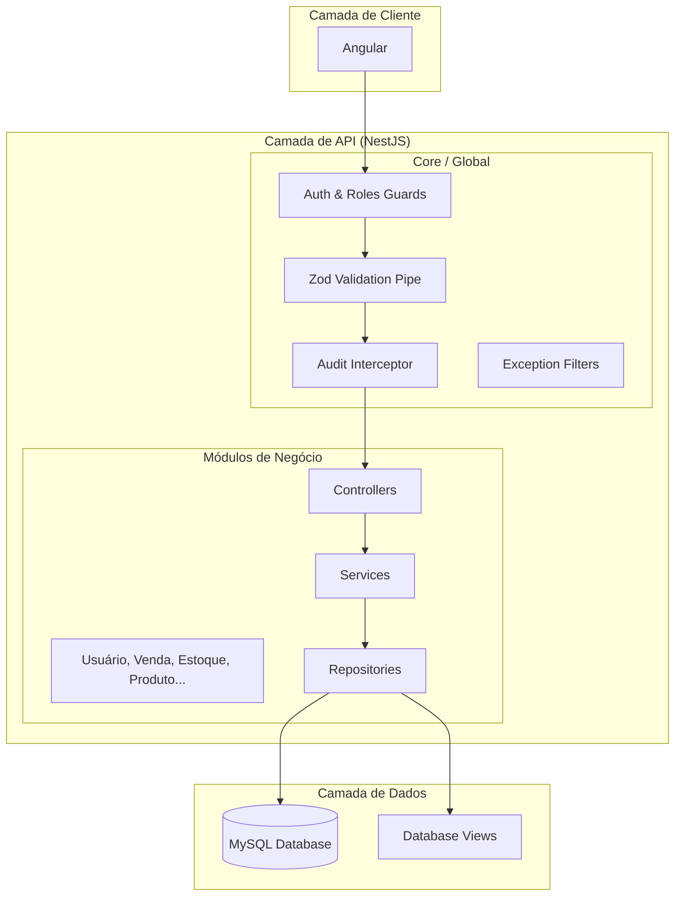
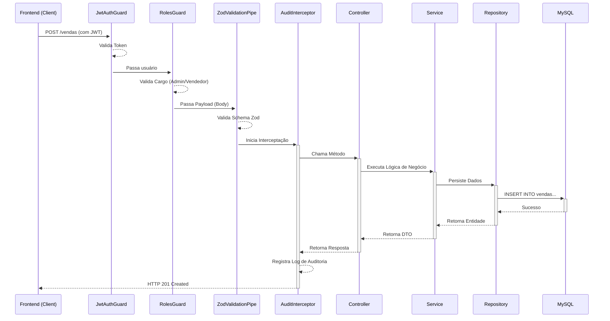

# Documentação de Arquitetura - ItaPrime ERP Backend

Esta documentação detalha a estrutura técnica, fluxos de dados e padrões de implementação utilizados no backend do ItaPrime ERP.

## 1. Visão Geral da Arquitetura

O sistema utiliza o framework **NestJS** seguindo uma **Arquitetura Modular (Vertical Slice)**. Cada módulo é autônomo e contém sua própria lógica de negócio, controladores, serviços e repositórios.

### Desenho Arquitetural



---

## 2. Fluxo de Requisição (Frontend para Banco de Dados)

O diagrama abaixo ilustra o ciclo de vida de uma requisição típica (ex: criação de uma venda).



---

## 3. Detalhes de Implementação

### 🔐 Autenticação e Autorização
- **Autenticação**: Baseada em **JWT (JSON Web Token)**. O token é extraído tanto do Header `Authorization: Bearer <token>` quanto de `Cookies` (para maior segurança em ambientes web).
- **Autorização (RBAC)**: Utiliza o `RolesGuard` junto com o decorador `@Roles()`. Os cargos são definidos no enum `TipoUsuario` (ex: `ADMIN`, `VENDEDOR`).

### ✅ Validação com ZodJS
O projeto utiliza `nestjs-zod` para garantir que os dados de entrada estejam corretos antes de chegarem aos serviços.
- **Schemas**: Definidos por módulo em `src/modules/<modulo>/schemas/`.
- **DTOs**: Criados a partir dos schemas usando `createZodDto`.

### 📄 Documentação Swagger
A documentação da API é gerada automaticamente e pode ser acessada em `/api`.
- Utiliza decoradores como `@ApiTags`, `@ApiOperation` e `@ApiResponse` nos controllers para enriquecer a documentação.

### 📝 Registro de Logs (Auditoria)
O `AuditInterceptor` é responsável por monitorar todas as operações de mutação (`POST`, `PUT`, `DELETE`, `PATCH`).
- **O que é registrado**: ID do usuário, ação realizada (ex: "CRIAÇÃO EM VENDA"), URL acessada e o payload da requisição.
- **Armazenamento**: Os logs são persistidos na tabela `logs` do MySQL para fins de rastreabilidade.

---

## 4. Organização de Pastas

```text
src/
├── config/             # Configurações de ambiente (EnvModule)
├── core/               # Componentes globais (Guards, Interceptors, Filters)
│   ├── decorators/     # Decoradores personalizados (@Roles, @Public)
│   ├── filters/        # Tratamento global de exceções
│   ├── guards/         # Segurança (JWT e RBAC)
│   └── interceptors/   # Auditoria e transformação de dados
├── database/           # Configuração do TypeORM, Seeds e Views
├── domain/             # Domínio compartilhado
│   └── entities/       # Entidades TypeORM (Mapeamento DB)
├── modules/            # Módulos de Negócio (Vertical Slices)
│   ├── auth/           # Módulo de Autenticação (Login, Strategy)
│   ├── usuario/        # Exemplo de módulo:
│   │   ├── dto/        # DTOs validados pelo Zod
│   │   ├── schemas/    # Definições de Schema Zod
│   │   ├── repositories/ # Camada de acesso a dados personalizada
│   │   ├── usuario.controller.ts
│   │   ├── usuario.service.ts
│   │   └── usuario.module.ts
│   └── ...             # Demais módulos (venda, estoque, etc.)
└── main.ts             # Ponto de entrada (Bootstrap)
```

---

## 5. Padrões de Implementação (Exemplos Reais)

Para manter a consistência, seguimos o padrão **Controller-Service-Repository**. Abaixo estão exemplos de como cada peça se encaixa no domínio de `Usuários`.

### 🗄️ Entidade (Entity)
As entidades mapeiam as tabelas do banco de dados e contêm decorators do TypeORM e hooks de ciclo de vida (como o hash de senha).

```typescript
@Entity('usuarios')
export class UsuarioEntity {
  @PrimaryColumn('uuid')
  id: string;

  @Column({ unique: true })
  login: string;

  @Column({ type: 'enum', enum: TipoUsuario })
  tipo: TipoUsuario;

  @BeforeInsert()
  async handleBeforeInsert() {
    this.id = randomUUID();
    this.senha = await bcrypt.hash(this.senha, 10);
  }
}
```

### ✅ Validação (Zod Schema)
Definimos a "forma" dos dados de entrada usando Zod, garantindo tipagem forte e mensagens de erro personalizadas.

```typescript
export const createUsuarioSchema = z.object({
  nome: z.string().min(3).max(100),
  login: z.email().min(5).max(50),
  senha: z.string().min(8),
  tipo: z.nativeEnum(TipoUsuario),
});

export class CreateUsuarioDto extends createZodDto(createUsuarioSchema) {}
```

### 🎮 Controlador (Controller)
Lida apenas com a interface HTTP, documentação Swagger e aplicação de regras de acesso (Roles).

```typescript
@ApiTags('Usuários')
@Controller('usuarios')
@Roles(TipoUsuario.ADMIN) // Apenas Admin pode criar usuários
export class UsuarioController {
  constructor(private readonly usuarioService: UsuarioService) {}

  @Post()
  @ApiOperation({ summary: 'Cadastrar novo usuário' })
  async createUser(@Body() createUsuarioDto: CreateUsuarioDto) {
    return this.usuarioService.createUsuario(createUsuarioDto);
  }
}
```

### ⚙️ Serviço (Service)
Onde reside a lógica de negócio, orquestração e lançamento de exceções controladas.

```typescript
@Injectable()
export class UsuarioService {
  constructor(private readonly usuarioRepository: UsuarioRepository) {}

  async createUsuario(dto: CreateUsuarioDto) {
    const existingUser = await this.usuarioRepository.findUserByEmail(dto.login);
    if (existingUser) {
      throw new ConflictException('Usuário já existe com este email');
    }
    return this.usuarioRepository.registrarUsuario(dto);
  }
}
```

---

## 6. Tecnologias Utilizadas

| Tecnologia | Descrição |
| :--- | :--- |
| **NestJS** | Framework Node.js para aplicações escaláveis. |
| **TypeORM** | ORM para integração com MySQL. |
| **ZodJS** | Biblioteca de declaração e validação de esquemas. |
| **Passport & JWT** | Padrão de segurança e autenticação. |
| **MySQL** | Banco de dados relacional. |
| **Swagger** | Ferramenta para documentação de APIs. |
| **Bcrypt** | Hashing de senhas para segurança. |
